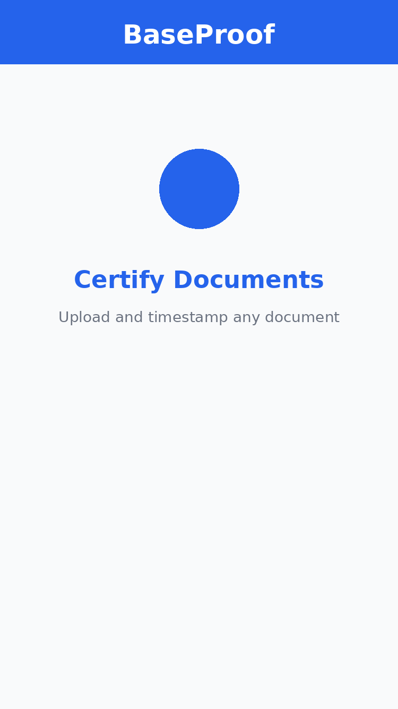
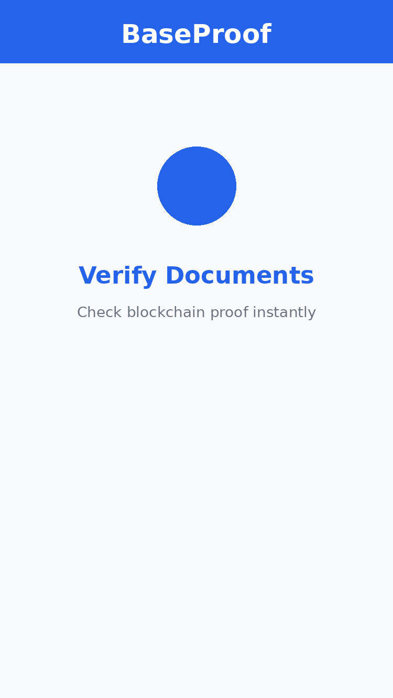
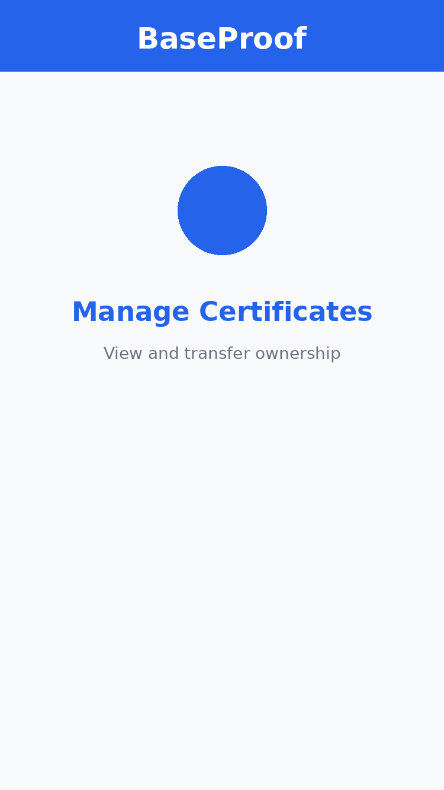

# BaseProof - Document Certification & Timestamping


**BaseProof** is a decentralized document certification and timestamping platform built on Base Mainnet. It allows anyone to certify documents, contracts, intellectual property, and creative works with immutable onchain proof of existence and ownership at a specific point in time.

🔗 **GitHub**: https://github.com/xam-dev-ux/BaseProof

---

## ⚠️ IMPORTANT DISCLAIMER

**USE AT YOUR OWN RISK** - This is experimental software. Smart contracts may contain bugs. Not legal advice. Read full [Terms of Use](/frontend/src/pages/Terms.tsx) before using.

---

## 🚀 Features

### Smart Contract
- ✅ **Document Certification**: Single and bulk certification with SHA-256 hashing
- ✅ **Privacy Controls**: Public/Private certificates with granular access
- ✅ **Ownership Transfer**: Transfer certificates with full provenance tracking
- ✅ **Co-Certification**: Multi-party document signing
- ✅ **Revocation System**: Controlled revocation with cooldown period
- ✅ **Expiration & Renewal**: Time-limited certificates with renewal capability
- ✅ **Challenge Mechanism**: Community-policed certificate validity
- ✅ **Bulk Discounts**: Up to 30% off for bulk certifications (10+ docs)
- ✅ **Gas Optimized**: Efficient storage and computation (~$0.10 per certification)

### Frontend
- ✅ **Base Mini App**: Fully integrated with Farcaster/Base ecosystem
- ✅ **Client-Side Hashing**: Documents never leave your device
- ✅ **Wallet Integration**: MetaMask and Web3 wallet support
- ✅ **Beautiful UI**: Professional design with TailwindCSS
- ✅ **PDF Certificates**: Download verification certificates with QR codes
- ✅ **Real-Time Stats**: Live blockchain data
- ✅ **Responsive Design**: Mobile-friendly interface
- ✅ **IPFS Integration**: Decentralized metadata storage

---

## 📸 Screenshots

<div align="center">
  
  
  
</div>

---

## 🏁 Quick Start

### Prerequisites
- Node.js 18+ and npm
- MetaMask or compatible Web3 wallet
- Base Mainnet ETH for gas fees

### Installation

```bash
# Clone the repository
git clone https://github.com/xam-dev-ux/BaseProof.git
cd BaseProof

# Install all dependencies
./install.sh
# or manually: npm run install:all

# Configure environment
cp .env.example .env
# Edit .env with your configuration
```

### Deploy Smart Contract

```bash
cd contracts
npm run compile
npm run test
npm run deploy
```

Copy the deployed contract address and update `frontend/.env`:
```env
VITE_PROOF_CONTRACT_ADDRESS=0x...your_deployed_address
```

### Start Frontend

```bash
cd frontend
npm run dev
```

Visit `http://localhost:3000` 🎊

---

## 📖 How It Works

### 1. Upload & Hash
Upload your document. BaseProof computes its unique SHA-256 fingerprint (hash). **Your document never leaves your device** - only the hash is stored onchain.

### 2. Certify Onchain
Pay a small fee (~0.001 ETH). Get an immutable timestamp and certificate on the Base blockchain. Choose public (anyone can verify) or private (only you can access details).

### 3. Verify Anytime
Anyone with the document can verify its certification. Prove who certified it, when, and if it's been altered since.

---

## 💼 Use Cases

- **Legal Contracts**: Timestamp agreements with irrefutable proof
- **Creative Works**: Prove authorship of art, music, writing
- **Patents & IP**: Establish prior art and invention dates
- **Academic Credentials**: Verify diplomas and certificates instantly
- **Business Documents**: Certify invoices, receipts, NDAs
- **Property Deeds**: Immutable proof of real estate ownership

---

## 📊 Project Structure

```
baseproof/
├── contracts/              # Smart contracts (Hardhat)
│   ├── contracts/
│   │   └── BaseProof.sol  # Main contract (800+ lines)
│   ├── scripts/
│   │   └── deploy.ts      # Deployment script
│   └── test/              # Comprehensive tests
├── frontend/              # React frontend (Vite)
│   ├── src/
│   │   ├── components/    # React components
│   │   ├── pages/         # Page components
│   │   ├── hooks/         # Custom hooks
│   │   └── utils/         # Utilities
│   └── public/
│       ├── farcaster.json # Base Mini App manifest
│       └── *.png          # All required images
└── docs/                  # Documentation
    ├── SETUP.md           # Setup guide
    ├── DEPLOYMENT.md      # Deployment guide
    └── USER_GUIDE.md      # User manual
```

**Total Lines of Code**: 5,200+
- Smart Contract: ~800 lines
- Frontend: ~2,500 lines
- Tests: ~400 lines
- Documentation: ~1,500 lines

---

## 🎨 Base Mini App Integration

BaseProof is a fully integrated **Base Mini App** with:

- ✅ `farcaster.json` manifest
- ✅ `fc:frame` embed metadata
- ✅ All required images (icon, splash, screenshots)
- ✅ Proper indexing configuration
- ✅ Social sharing support

### Trigger Indexing
1. Deploy to production (Vercel/Netlify)
2. Share your Mini App URL in Farcaster feed
3. Indexing starts automatically
4. Verify at: https://warpcast.com/~/developers/miniapps

---

## 💰 Fees & Costs

### Platform Fees
- **Certification**: 0.001 ETH (~$2.50) per document
- **Transfer**: 0.0005 ETH (~$1.25) per transfer
- **Renewal**: 0.001 ETH (~$2.50)

### Bulk Discounts
- 10-49 docs: **10% off**
- 50-99 docs: **20% off**
- 100+ docs: **30% off**

### Gas Costs (Estimated)
- Certify single: ~60,000 gas (~$0.08-0.10)
- Certify bulk (10): ~400,000 gas (~$0.05-0.06 per doc)
- Transfer: ~40,000 gas (~$0.05-0.06)
- **Verify: FREE** (view function)

---

## 🔒 Security

- **ReentrancyGuard**: Protection against reentrancy attacks
- **Ownable2Step**: Secure ownership transfer
- **Pausable**: Emergency stop mechanism
- **Input Validation**: All user inputs validated
- **Hash Uniqueness**: Same document cannot be certified twice
- **No Unbounded Loops**: Gas-safe implementation
- **Privacy-First**: Documents never stored onchain

---

## 🧪 Testing

```bash
cd contracts
npm run test
```

Comprehensive test suite covering:
- Document certification
- Bulk operations
- Transfers
- Revocations
- Co-certification
- Privacy controls
- Edge cases

---

## 📚 Documentation

- **[Setup Guide](docs/SETUP.md)** - Installation and configuration
- **[Deployment Guide](docs/DEPLOYMENT.md)** - Production deployment
- **[User Guide](docs/USER_GUIDE.md)** - How to use BaseProof
- **[Project Structure](PROJECT_STRUCTURE.md)** - Architecture overview

---

## 🛠️ Technology Stack

### Blockchain
- Solidity 0.8.24
- Hardhat
- OpenZeppelin Contracts
- Base Mainnet (Chain ID: 8453)

### Frontend
- React 18
- TypeScript
- Vite 5
- TailwindCSS 3
- React Router v6
- React Query (caching)
- Zustand (state)
- Ethers.js v6
- Framer Motion

### Infrastructure
- IPFS (metadata storage)
- Base Mini Apps
- Farcaster integration

---

## 🚀 Deployment

### Frontend (Vercel)

```bash
cd frontend
vercel --prod
```

Or connect GitHub repo in Vercel dashboard.

### Smart Contract (Base Mainnet)

```bash
cd contracts
npm run deploy
```

See [DEPLOYMENT.md](docs/DEPLOYMENT.md) for detailed instructions.

---

## 🤝 Contributing

Contributions are welcome! Please:

1. Fork the repository
2. Create a feature branch (`git checkout -b feature/amazing-feature`)
3. Commit your changes (`git commit -m 'Add amazing feature'`)
4. Push to the branch (`git push origin feature/amazing-feature`)
5. Open a Pull Request

---

## 📄 License

This project is licensed under the MIT License - see the [LICENSE](LICENSE) file for details.

**Important**: This software comes with NO WARRANTY. Use at your own risk. See full disclaimer in LICENSE.

---

## 🙏 Acknowledgments

- Built on [Base](https://base.org) - Ethereum L2
- Smart contracts secured by [OpenZeppelin](https://openzeppelin.com)
- Metadata stored on [IPFS](https://ipfs.io)
- Integrated with [Farcaster](https://farcaster.xyz)

---

## 📞 Support

- **Documentation**: [docs/](./docs/)
- **Issues**: [GitHub Issues](https://github.com/xam-dev-ux/BaseProof/issues)
- **Discussions**: [GitHub Discussions](https://github.com/xam-dev-ux/BaseProof/discussions)

---

## 🎯 Roadmap

- [ ] Multi-chain support (Ethereum, Polygon, Optimism)
- [ ] Mobile app (iOS/Android)
- [ ] Template marketplace
- [ ] API for integrations
- [ ] DAO governance
- [ ] Insurance products for high-value IP

---

<div align="center">

**"Prove It. Protect It. Forever."** 🛡️

Made with ❤️ for the Base ecosystem

[Website](https://baseproof.vercel.app) • [GitHub](https://github.com/xam-dev-ux/BaseProof) • [Documentation](docs/)

</div>
